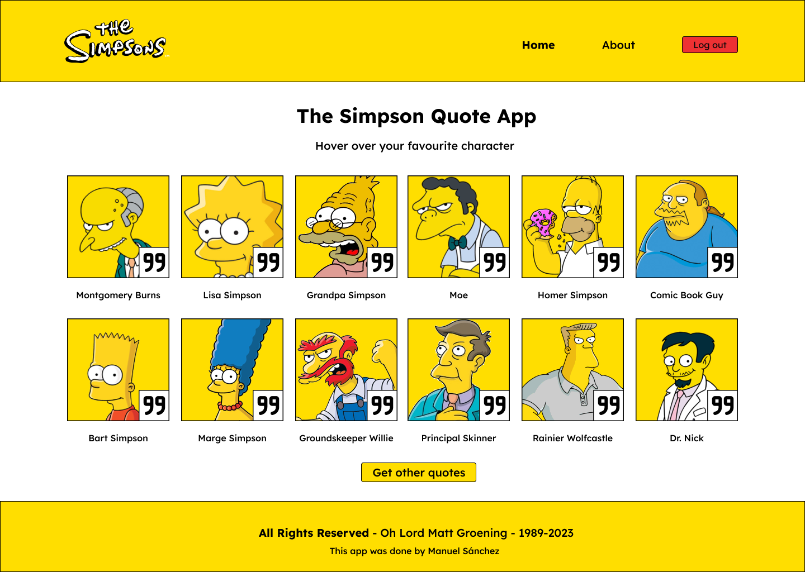

<div align="center" style="margin-bottom: 10px;" >



# 🟡 The Simpsons Quote App

Aplicación realizada para el curso avanzado de Qwik de la aclamada serie en la que mostramos quotes de algunos de sus personajes

</div>

## 💾 API e imágenes

- 01: [API e imágenes de The Simpsons Quote App](https://thesimpsonsquoteapi.glitch.me/quotes)

## Vercel Edge

This starter site is configured to deploy to [Vercel Edge Functions](https://vercel.com/docs/concepts/functions/edge-functions), which means it will be rendered at an edge location near to your users.

## Installation

The adaptor will add a new `vite.config.ts` within the `adapters/` directory, and a new entry file will be created, such as:

```
└── adapters/
    └── vercel-edge/
        └── vite.config.ts
└── src/
    └── entry.vercel-edge.tsx
```

Additionally, within the `package.json`, the `build.server` script will be updated with the Vercel Edge build.

## Production build

To build the application for production, use the `build` command, this command will automatically run `npm run build.server` and `npm run build.client`:

```shell
npm run build
```

[Read the full guide here](https://github.com/BuilderIO/qwik/blob/main/starters/adapters/vercel-edge/README.md)

## Dev deploy

To deploy the application for development:

```shell
npm run deploy
```

Notice that you might need a [Vercel account](https://docs.Vercel.com/get-started/) in order to complete this step!

## Production deploy

The project is ready to be deployed to Vercel. However, you will need to create a git repository and push the code to it.

You can [deploy your site to Vercel](https://vercel.com/docs/concepts/deployments/overview) either via a Git provider integration or through the Vercel CLI.
